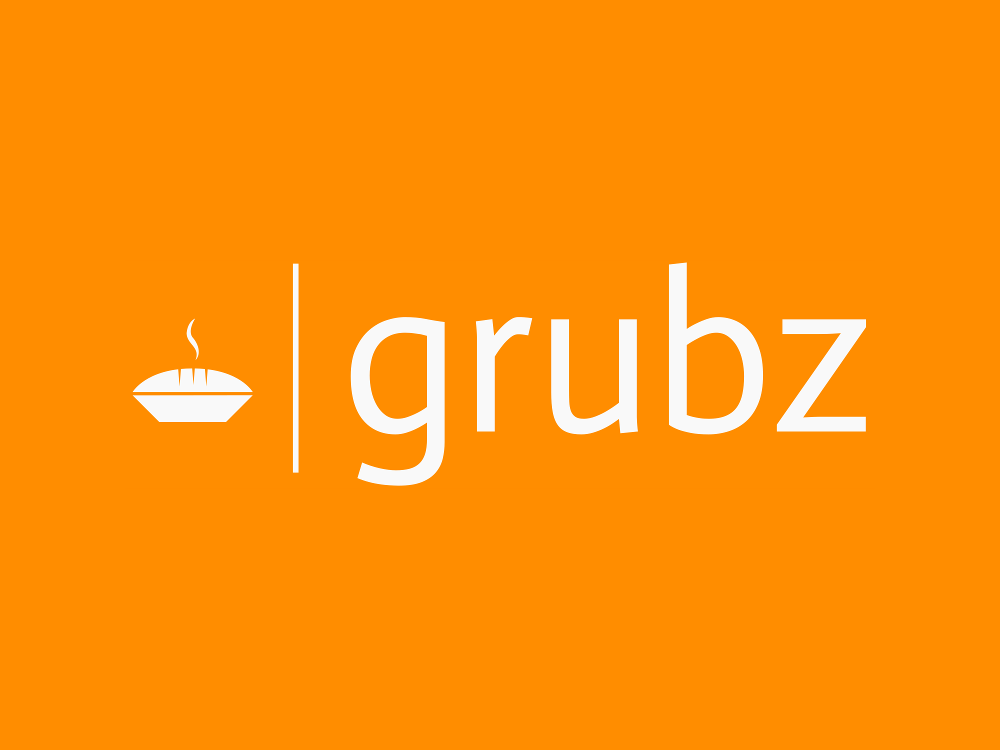

<p align="center">
  
</p>

# 🥡 Grubz Backend – MVP


Grubz is a **community-first food ordering platform** built to connect users within institutions (universities, campuses, organizations, etc.) to nearby food vendors. This backend is built using **Node.js**, **Express**, **PostgreSQL**, and **Sequelize**.

---

## ⚙️ Tech Stack

- **Backend:** Node.js + Express
- **Database:** PostgreSQL + Sequelize ORM
- **Authentication:** JWT + Role-Based Access Control (RBAC)
- **Payments:** M-Pesa STK Push & Stripe API (KES currency)

---

## 🧑‍💻 User Roles

- **User (Community Member):**
  - Browse menus, place orders, track order status
- **Vendor:**
  - Manage menus, fulfill orders, view analytics
- **Community Admin:**
  - Manage vendors in their community
- **Platform Admin:**
  - Approve vendors, manage global stats (handled in a separate admin app)

---

## 🚀 Key Features (Implemented)

- ✅ Secure **JWT Authentication** and **RBAC**
- ✅ Community-scoped access to orders, menus, and vendors
- ✅ Full **Vendor Order Fulfillment** flow:
  - Accept / Reject orders
  - Mark as Ready / Delivered
- ✅ Scoped **Menu Management** (Vendor only)
- ✅ **Customer Orders:**
  - Quantity handling
  - Single-vendor constraint
- ✅ Payments:
  - 🔐 M-Pesa STK Push (Sandbox)
  - 💳 Stripe Checkout (KES currency)
- ✅ Admin Scaffolding:
  - Community Admin & Platform Admin logic initialized
    
---

## 🧪 Getting Started (Development)

### 1. Clone the repository

```bash
git clone https://github.com/your-username/grubz-backend.git
cd grubz-backend
```

### 2. Install dependencies
```bash
npm install
```

### 3. Set up your .env file
```bash
PORT=5000

DB_NAME=grubz_db
DB_USER=your_db_user
DB_PASSWORD=your_db_pass
DB_HOST=localhost

JWT_SECRET=your_jwt_secret

MPESA_CONSUMER_KEY=...
MPESA_CONSUMER_SECRET=...
MPESA_SHORTCODE=174379
MPESA_PASSKEY=...
MPESA_CALLBACK_URL=https://<your-ngrok-subdomain>.ngrok-free.app/api/payments/webhook/mpesa

STRIPE_SECRET_KEY=...
STRIPE_WEBHOOK_SECRET=...

NGROK_URL=<your-ngrok-subdomain>.ngrok-free.app

```

### 4. Run migrations and seeders
```bash
npx sequelize-cli db:migrate
npx sequelize-cli db:seed:all
```

### 5. Start the development server
```bash
npm run dev
```

---

## 📁 Project Structure

```bash
.
├── controllers/         # Route logic for each role and feature
├── routes/              # REST API endpoints
├── models/              # Sequelize models and associations
├── services/            # Payment integrations (Mpesa, Stripe)
├── middleware/          # Auth, authorization, error handling
├── utils/               # Utility functions (JWT, validators, etc.)
├── app.js               # Express app setup
└── config/              # DB and environment config
```

---

## 🛣️ Roadmap

Features coming soon:

- 🧠 Admin dashboards (Community & Platform)
- 🛎️ Real-time order updates (e.g. via Socket.io)
- 🌟 Feedback & rating system for meals/vendors
- 💼 Vendor earnings reports & order summaries
- 💰 Wallet system with top-ups and withdrawals
- 📧 Email/SMS order notifications

## 📄 License

This project is licensed under the MIT License — see the LICENSE file for details.

---

## ✨ Contributors

Lead developer - [@nshutip](https://github.com/nshutip)
